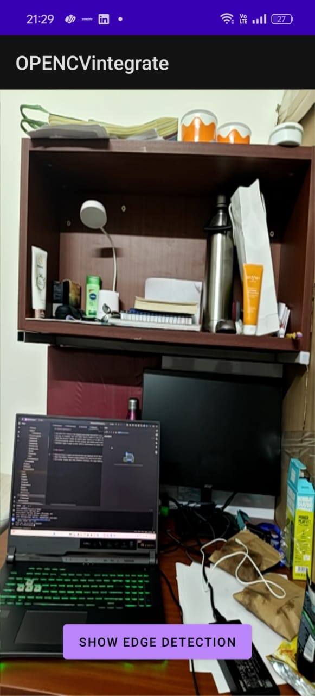

# ⚡ Real-Time Edge Detection Camera & Web Viewer

This project demonstrates a **high-performance, real-time edge detection pipeline** on **Android**, integrated with a **modern TypeScript-based web viewer** to visualize processed frames.

---

## 📸 Screenshots

| Normal Camera View | Edge Detection View |
| :----------------: | :-----------------: |
|  |  |


---

## ✅ Features Implemented

### 📱 **Android Application**

- **Live Camera Feed:** Captures high-framerate video using Android’s **CameraX API**.
- **Real-Time C++ Processing:** Sends every camera frame to a **C++ native layer** via **JNI** for maximum performance.
- **OpenCV Edge Detection:** Uses **OpenCV (C++)** to apply **Canny Edge Detection** on every frame.
- **GPU-Accelerated Rendering:** Smoothly renders the processed video using **OpenGL ES 2.0**, ensuring responsive UI.
- **Interactive Toggle:** Tap a button to switch between **original** and **edge-detected** views in real time.

### 💻 **Web Viewer**

- **Modern TypeScript + Vite Stack:** Lightweight and fast setup for web visualization.
- **Static Frame Display:** Displays a sample processed frame from the Android app.
- **Dynamic Stats Overlay:** Uses DOM manipulation in TypeScript to show frame metadata (e.g., resolution, FPS).

---

## 🧠 Architecture Overview

The project follows a modular, high-performance data flow from Java → C++ → OpenGL → Display.

```mermaid
graph TD

A[📷 CameraX API] --> B[MainActivity.java]
B --> |"1️⃣ Sends ImageProxy"| C[ImageConverter.java]
C --> |"2️⃣ Converts to Mat"| B
B --> |"3️⃣ JNI → processFrame(Mat)"| F[native-lib.cpp]
F --> |"4️⃣ Processes Frame (OpenCV Canny)"| B
B --> |"5️⃣ Converts Mat → Bitmap"| D[MyGLRenderer.java]
D --> |"6️⃣ Renders via OpenGL ES 2.0"| E[GLSurfaceView]
E --> |"7️⃣ Displays Frame"| G((📺 Screen Output))
